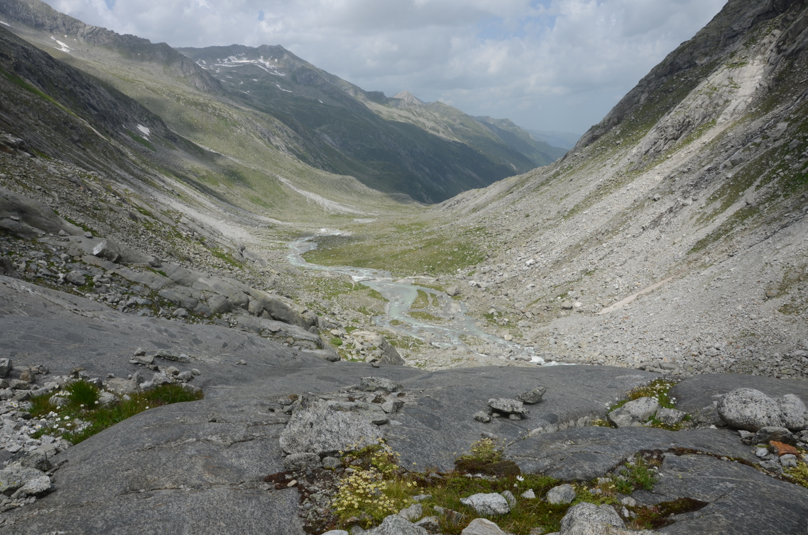

<table>
<tr><td></td>
<td bgcolor="#FFFFFF">
<h1>Ice-age dynamics</h1>
<h2>Georg Kaufmann</h2>
</td>
</tr>
</table>

Master course tought at [Freie Universität Berlin](http://fu-berlin.de) in the 
**M.Sc. Geological Sciences** program.

## Course summary

This lecture introduces ice ages as a tool to examine the dynamical behaviour of both the Earth's surface and the Earth's interior.

- We discuss causes and consequences of global ice ages and discuss reconstructions of past ice sheets, 
depending of changes in the past and present climate.
- We use observations such as strand lines, GPS-determined uplift rates, the Earth's changing gravity field to 
describe the dynamical response of the Earth to ice-age cycles.
- We will develop a process-based understanding of the dynamical response of the Earth to changes in the ice-ocean mass balance.

## Course instructor

[Georg Kaufmann](http://userpage.fu-berlin.de/~geodyn)<br>
Freie Universität Berlin<br>
Department of Geosciences, Institute of Geological Sciences, Geophysics Section<br>
Malteserstr. 74-100, 12249 Berlin, Haus D, Raum D127<br>
[georg.kaufmann@fu-berlin.de](mailto:georg.kaufmann@fu-berlin.de)

## Course How-To

- You should follow the lectures, preferrably in consecutive order.
- In each lecture, we start with an overview, then as main part the self-learning lecture notes can be downloaded.
- Then, a practical part follows, which is often a link to a python page for simple programming exercises, or some homework.

## Lectures

The lecture series is compiled as handouts in **pdf** format:

- [Lecture 0: Overview](handouts/Lecture_IceAges_00_Overview_handout.pdf)
- Lecture 1: Ice on Earth
- Lecture 2: Geomorphology
- Lecture 3: Dating
- Lecture 4: Paleoclimate
- Lecture 5: Karst
- Lecture 6: Earth orbit
- Lecture 7: Ice models
- Lecture 8: Sea level
- Lecture 9: Landscape

## Exercises

The exercises are mainly **jupyter** notebooks, which can be accessed through:

- [Juypter notebooks](index.ipynb)

## Download
```
git clone https://github.com/georgkaufmann/lecture_iceage.git
```

## Run interactively with binder

[](https://mybinder.org/v2/gh/georgkaufmann/lecture_iceage.git/master?filepath=index.ipynb)

## Versioning

We use [Git](https://git-scm.com/) for versioning.

## Authors

* **Georg Kaufmann** - *Initial work* - [Georg Kaufmann](http://userpage.fu-berlin.de/~geodyn)


## License

This project is licensed for classroom use only.

## Acknowledgments
