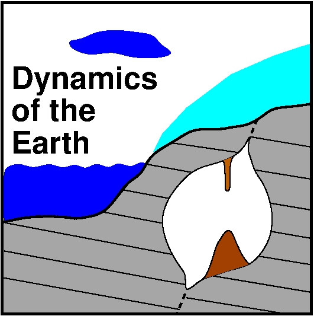

<table>
<tr><td></td>
<td bgcolor="#FFFFFF">
    
AG Dynamics of the Earth

    
Jupyter notebooks

    
Georg Kaufmann

    </td>
</tr>
</table>

# Ice-age dynamics
----
*Georg Kaufmann,
Geophysics Section,
Institute of Geological Sciences,
Freie Universität Berlin,
Germany*

**Additional jupyter notebooks for lecture**

Lectures:

- Lecture 1: Ice on Earth
    - [Basic python](IceDyn_chap01_intro.ipynb)
- Lecture 2: Geomorphology
    - [Random numbers](IceDyn_chap02_random.ipynb)
    - [Simple integration](IceDyn_chap02_simpleintegration.ipynb)
- Lecture 3: Dating
    - [Radioactive decay](IceDyn_chap03_decay.ipynb)
- Lecture 4: Paleoclimate
    - [Temperature record](IceDyn_chap04_Hohenpeissenberg_temp.ipynb)
    - [CO$_2$ and $\delta$H record](IceDyn_chap04_Antarctica_CO2_dH.ipynb)
- Lecture 5: Karst
    - [Stable isotopes](IceDyn_chap05_isotopes.ipynb)
    - [Rayleigh fractionation](IceDyn_chap05_rayleigh_1sink.ipynb)
    - [Carbon isotopes](IceDyn_chap05_rayleigh_2sinks.ipynb)
    - [Oxygen isotopes](IceDyn_chap05_rayleigh_3sinks.ipynb)
- Lecture 6: Earth orbit
    - [Sinus](IceDyn_chap06_sinus.ipynb)
    - [Orbits](IceDyn_chap06_orbits.ipynb)
    - [Simple ice-volume models](IceDyn_chap06_icevolume.ipynb)
- Lecture 7: Ice models
    - [Ice sheets](IceDyn_chap07_simpleice.ipynb)
- Lecture 8: Sea level
    - [Gravity](IceDyn_chap08_gravity.ipynb)
    - [Length of day](IceDyn_chap08_rotation.ipynb)
- Lecture 9: Landscape
    - [Diffusion](IceDyn_chap09_diffusion1D.ipynb)
    - [Erosion](IceDyn_chap09_erosion1D.ipynb)
    - [Denudation](IceDyn_chap09_denudation1D.ipynb)
- Lecture 10: Glacial isostatic adjustment

